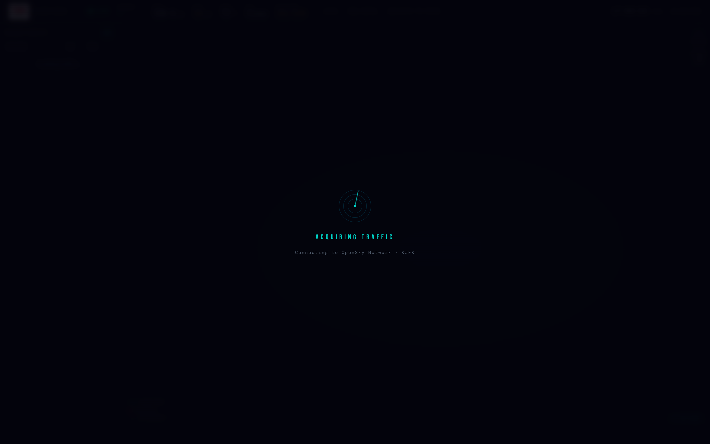
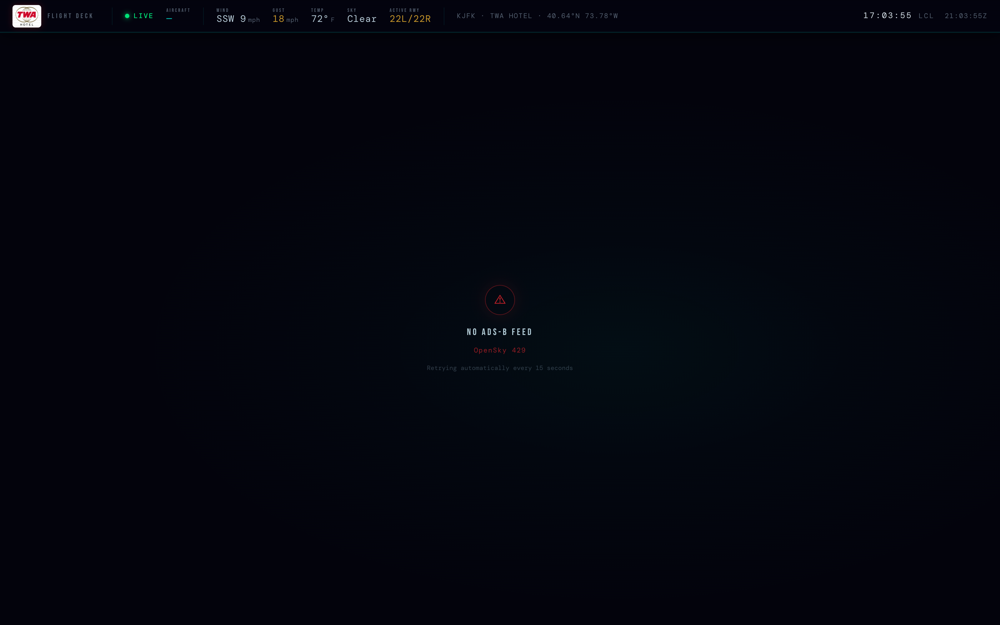
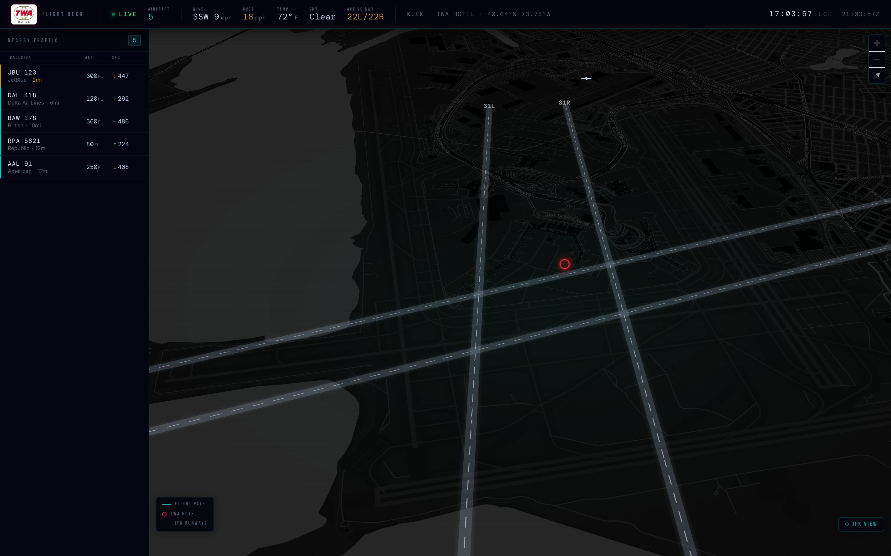
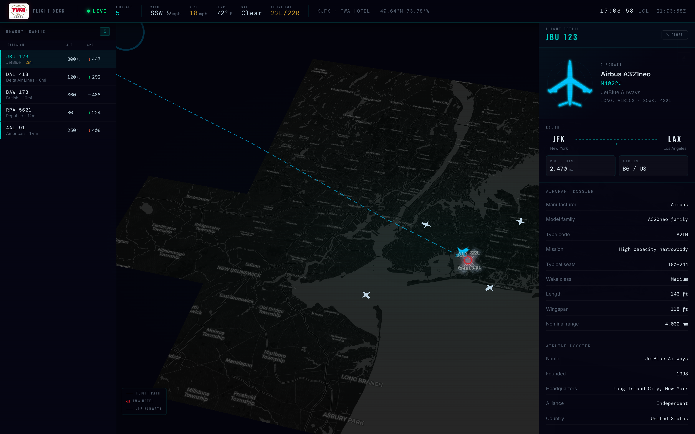
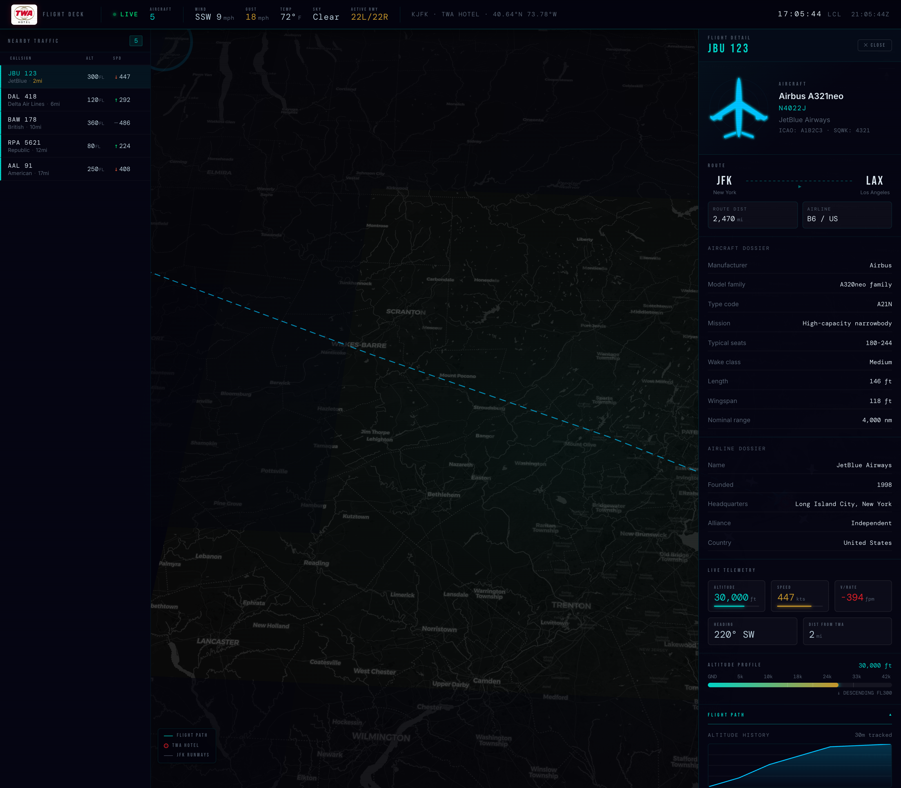

# TWA Hotel Flight App

Live traffic display constrained to the immediate JFK/TWA airspace:
- 12-mile radius around JFK for map + OpenSky state query.
- Both airborne and on-ground positioned aircraft are considered for display.
- Flights whose resolved route is to or from JFK.
- Final display filtered to aircraft within visual range of the TWA Hotel.

## Screenshots

### Loading



### API Error



### Traffic Overview



### Flight Detail



### Flight Path



## Data Sources

- OpenSky Network state vectors: live ADS-B position, altitude, speed, heading, vertical rate, squawk.
- Deliberate secondary JFK-only fallback feed (optional): map-state payload for continuity when OpenSky is blocked.
- ADSBDB: selected-flight aircraft registration, type/manufacturer/model, owner/operator, aircraft photo, airline, origin, and destination.
- Local supplemental facts: broad aircraft type specs and airline founding/headquarters data for richer detail when only a few aircraft are visible from the hotel.

Supplemental aircraft values are intentionally approximate operating context, not dispatch data. Seat counts vary by airline cabin layout.

## Selection Behavior

- Selecting an aircraft keeps the map camera in the current view (no automatic flight-path zoom/fly-to).
- While an aircraft is selected, live telemetry refreshes faster:
  - Authenticated OpenSky client: every 2.5 seconds
  - Anonymous mode: every 5 seconds

## Development

```sh
npm install
npm run dev
```

### OpenSky Auth Configuration

- Browser never sends `client_secret` directly.
- Vite dev server exchanges credentials at `/api/opensky-auth` using server-side env values.
- Supported env names: `OPENSKY_CLIENT_ID` / `OPENSKY_CLIENT_SECRET`.
- Backward-compatible aliases also supported: `VITE_OPENSKY_CLIENT_ID` / `VITE_OPENSKY_CLIENT_SECRET`.
- If credentials are missing, app falls back to anonymous OpenSky requests.

### Fallback Feed Configuration (JFK backup)

When primary OpenSky access is blocked, the app can switch to a separate JFK feed with auto-recovery to primary.

- `VITE_FALLBACK_FEED_URL` (required to enable): full URL or same-origin path to an alternate state feed.
- `VITE_FALLBACK_FEED_PROVIDER`: `generic` (default), `opensky`, or `fr24`.
- `VITE_FALLBACK_FEED_LABEL`: status label shown in HUD (default `KJFK FALLBACK`).
- `VITE_FALLBACK_FEED_TIMEOUT_MS`: fetch timeout in ms (default `14000`).
- `VITE_FALLBACK_PRIMARY_RETRY_MS`: cooldown before re-checking primary after a fallback switch (default `45000`).
- `VITE_FALLBACK_TRACK_WINDOW_MS`: window in ms used to rebuild local paths for fallback-selected flights (defaults to 10 minutes when unset).
- `VITE_FALLBACK_FEED_PROXY_TARGET`: optional Vite proxy target host for same-origin proxying.
- `VITE_FALLBACK_FEED_PROXY_PATH`: optional proxy path (default `/api/jfk-fallback`) when proxy target is used.

## Gate

```sh
npm run lint
npm run build
```
